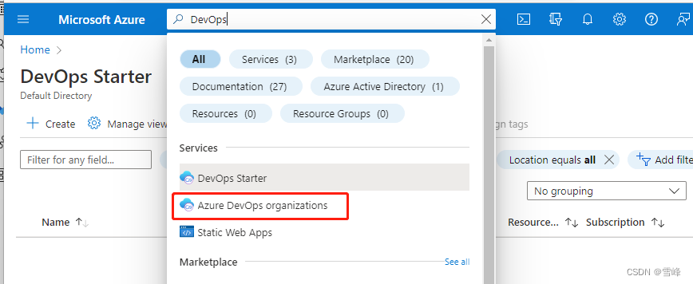
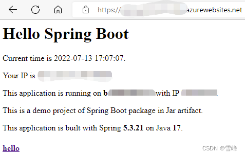

# Azure DevOps部署Java Spring 应用到Azure App Service

发布时间: *2022-07-13 10:57:47*

简介: Azure DevOps是微软Azure云平台上端到端的企业级研发管理平台，其中Azure Pipelines是使用流水线实现CI/CD的核心服务。Azure App Service是一个为开发人员提供的完全托管的平台即服务 (PaaS) 产品。Spring Boot是当前Java应用最主流的开发框架。本文以一个基本的实例，详细讲解使用Azure Pipelines创建和编辑流水线，把Java Spring 应用构建并部署到 Azure App Service..........

原文链接: [https://snowpeak.blog.csdn.net/article/details/125759341](https://snowpeak.blog.csdn.net/article/details/125759341)

---------

Azure DevOps是微软Azure云平台上端到端的企业级研发管理平台，其中Azure Pipelines是使用流水线实现CI/CD的核心服务。Azure App Service（应用服务）是一个为开发人员提供的完全托管的平台即服务 (PaaS) 产品，可以快速搭建基于HTTP的 Web应用、API和移动后端。Spring Boot是当前Java应用最主流的开发框架。本文以一个基本的实例，详细讲解使用Azure Pipelines创建和编辑流水线，把Java Spring 应用构建并部署到 Azure App Service上。

## Java Spring 演示代码

源码在这里 [GitHub - xfsnow/SpringTomcat: A demo project of Spring Boot running in Tomcat deployed to Azure App Service with Azure DevOps.](<https://github.com/xfsnow/SpringTomcat> "GitHub - xfsnow/SpringTomcat: A demo project of Spring Boot running in Tomcat deployed to Azure App Service with Azure DevOps.")，请 fork 到自己的GitHub里以便后面练习使用。或者以此为参考，直接使用Visual Studio Code中Spring Initializr 创建默认的Maven Project 也行，注意打包模式要选择war包，因为我们要使用外部的Tomcat Server，而不使用Spring Boot内置的Tomcat Server。pom.xml 中有以下配置项需注意：


```xml
<properties>
	<java.version>11</java.version>
</properties>
```

引用Tomcat Server相关的库，以方便使用javax.servlet系的包。

```xml
    <dependency>
      <groupId>org.apache.tomcat</groupId>
      <artifactId>tomcat-servlet-api</artifactId>
      <version>10.0.8</version>
    </dependency>
    <dependency>
      <groupId>org.apache.tomcat</groupId>
      <artifactId>tomcat-jsp-api</artifactId>
      <version>10.0.8</version>
    </dependency>
```

## 创建Azure App Service实例

登录Azure控制台https://portal.azure.com/，找到 App Service服务，点击左上角的 Create创建一个App Service实例。在创建的向导中，Basics页重点几项是Instance Details部分的配置。

Publish 选Code；

Runtime Stack 选Java 11；

Java web server stack 选Apache Tomcat 9.0；

Operating System 选 Linux；

Region选择主流的区域即可，此例中选择East Asia。

App Service Plan 选择免费档的Free F1级别，这样可以充分利用Azure的免费机会，不产生资源费用。


注意这里选择的Java 11和Tomcat 9.0 都是和演示代码中配置使用的Java及Tomcat 版本适配的，演示代码选择这样的版本则是来自于当前Spring Boot版本5.3.21所要求的依赖。Azure DevOps Pipeline中内置的Maven要求Java 11版本才能构建。最终实现开发、CI和部署环境的运行时版本一致，将来部署到App Service后可以正常运行。否则会报依赖错误以及404等错误。

其它向导页都保持默认即可，点“Create”按钮创建。

稍等几分钟，实例资源创建好。来到这个App Service实例的Overview页，点击右边的URL，如https://contoso.azurewebsites.net，可以跳到新窗口打开这个应用。Java应用首次运行还需要等几分钟，直到能看到类似如下的默认首页，即可表示这个App Service已经创建成功。


下面我们会用Azure DevOps的Pipeline把前面提到的演示应用部署上去替换这个默认首页。

## 配置Azure Pipeline构建和部署Java应用

### 从Azure控制台跳转到Azure DevOps专用控制台的Pipelines

在Azure 控制台最上边的搜索栏输入DevOps，然后点击DevOps Organizations。



会来到跳转到DevOps专门控制台的过渡页。


再点击这个My Azure DevOps Organizations链接。前进到选择DevOps组织页。


我这里有只有一个组织，点击这个组织的链接，就可以最终来到Azure DevOps专用的控制台了。


再点击第一个项目大方块，进入到项目控制台。最后点击左侧导航链接中蓝色火箭图标，就到了流水线管理的界面。

### 创建Azure Pipeline流水线

在Azure Pipelines主界面点击右上角的 New pipeline按钮，新建一个流水线。根据创建流水线向导，在Where is you code选择GitHub。

如果是首次连接GitHub，会跳转到GitHub登录和授权的页，按提示操作即可。

然后到Select a repository，选择你前面fork下来的源码库。

到Configure页，选择Maven package Java project Web App to Linux on Azure。


这时会弹层，按提示选择Azure的订阅，资源组，以及前面创建出来的App Service资源。


在下一页 Web App name下拉菜单选择之前创建出的App Service实例。


App Service中新创建的实例可能不能显示在下拉菜单中，请耐心等待直到其可以显示出来。选择相应实例名后，点击右下角的Validate and configure按钮。稍等几秒，之后会跳转到Review 页面。


建议点击文件名，重命名成有意义的名字，比如pipelines-Build-Deploy-AppService.yml。

点击右上角Save and run按钮。在弹出的提示层里，建议Commit message写上有意义的消息，因为默认情况下这个流水线文件会提交到同一个源码库中。最后点击弹层右下角的Save and run按钮，之后会跳转到流水线运行的界面。


点击Build Stage，还可以前进到正在进行的任务的日志界面。


构建执行完成后，Deploy stage 在首次部署到 Azure App Service 时需要确认授权。


点击 View 按钮，在弹出的 Waiting for review 弹层，点击 Permit 授权，弹层再点击 Permit 确认即可。


授权之后 Deploy stage 会继续执行，直到顺利完成。然后我们可以看到流水线运行页的Summary中显示Related 下有个 1 published。


点击这个链接，再逐级展开，可以看到构建好的制品名是spring-0.0.1-SNAPSHOT.war。


## 查看Azure App Service部署情况

回到Azure控制台https://portal.azure.com/，找到 App Service实例，点击左侧导航中Deployment 下的Deployment Center。可以看到显示如下部署成功的记录。


再回到Overview页点击右侧的对外提供服务的URL，会发现网站首页报错404了。


因为我们项目的pom.xml中声明了这个项目的制品文件名是spring-0.0.1-SNAPSHOT.war，前面在流水线完成结果中看到的也是这个名字，所以默认部署在Tomcat Server时会增加一个子路径/spring-0.0.1-SNAPSHOT。咱们在前述App Service的URL后面加上/spring-0.0.1-SNAPSHOT 就可以访问了。


## 配置到App Service站点根目录

Tomcat Server中部署到网站根目录，有个简单的小办法，就是把war包名指定为 ROOT.war。我们在Pipelines流水线中加一个重命名的步骤就可以了。在Pipeline列表中点击咱们创建出的流水线，再点击右上角的Edit按钮，编辑一下。


在编辑界面里找到 \- task: CopyFiles@2 这个任务，在这行上面增加。


```yaml
# 增加一个重命名的步骤，把打包制品文件名统一成 ROOT.war，以便后续部署到 App Service 的根目录。
- bash: |
  echo $(System.DefaultWorkingDirectory)
  mv $(System.DefaultWorkingDirectory)/target/*.war $(System.DefaultWorkingDirectory)/target/ROOT.war
```

这个任务其实是使用的Pipeline中执行 bash 命令的任务类型，$(System.DefaultWorkingDirectory)是个Pipeline中的环境变量，前面构建的任务会根据我们pom.xml中指定的输出设置构建成 hello.war，我们用 mv 命令把它重命名成 ROOT.war。保存流水线后会自动执行，等待执行完毕。我们再到App Service对外服务的URL，重新刷新一下，应用已经可以从域名根目录访问了。

