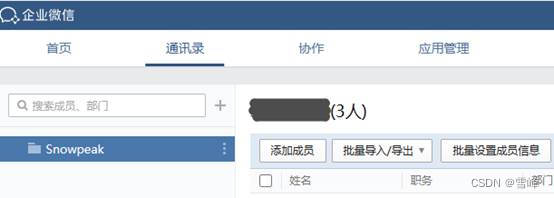

# 使用腾讯企业邮箱配置免费域名邮箱

发布时间: *2023-05-08 14:44:11*

分类: __系统管理__

简介: 各位开发者自己部署个人网站现在很普遍了，也会因此注册自己的域名，但是部署邮件服务器就没那么简单了。腾讯企业邮箱的免费版也可绑定域名，只需简单几步，就可以有自己的域名邮箱啦。

原文链接: [https://snowpeak.blog.csdn.net/article/details/130558658](https://snowpeak.blog.csdn.net/article/details/130558658)

---------

各位开发者自己部署个人网站现在很普遍了，也会因此注册自己的域名，但是部署邮件服务器就没那么简单了。腾讯企业邮箱的免费版也可绑定域名，只需简单几步，就可以有自己的域名邮箱啦。

免费版腾讯企业邮箱，只有一个企业，只能绑定一个域名，最多100个成员，即100个邮件地址，对个人开发者来说，已经足够用了。过程中需要下载和使用企业微信，腾讯已经提供这么多免费服务了，支持一下也可以啦。

## 创建免费企业

[企业微信](<https://work.weixin.qq.com/> "企业微信")

点击 立即注册

对于个人开发者来说，这里的内容自行填写，只是需要个人微信绑定成企业微信。

## 为邮件绑定域名

注册企业后登录，点击协作下面的邮件，再点“企业已有官网”按钮。

输入自有域名，点下一步验证。

检测出我的域名在阿里云注册的，下一页直接给出在阿里云DNS解析的说明，其它域名注册平台的配置类似。核心是4 条DNS解析记录。

最后点击“完成配置，验证”按钮就行了。

## 使用自己的域名创建邮件

到通讯录模块下点击“添加成员”按钮，添加企业的新成员，就可以使用自己域名来配置邮件了。

在企业邮箱这里，域名可以选择出自己绑定的域名。下面第二个域名是企业微信分配的二级域名。如果看不到自己绑定的域名，请耐心等待一会。如果还不行，可以点右上角的“联系客服”，通过客服的企业微信寻求帮助，按客服要求提供一些审核资料后可以手工验证域名，然后就可使用自己的域名了。

## 登录使用域名邮件

邮件的终端使用需要先用企业微信App登录并接受邀请进入这个企业，同时就激活了这个邮件。然后可以使用浏览器访问 https://exmail.qq.com/login。首次使用必须企业微信扫码登录。登录进去之后 ，可以再自行设置密码，之后就可以不用企业微信扫码，而用账号密码登录了。

