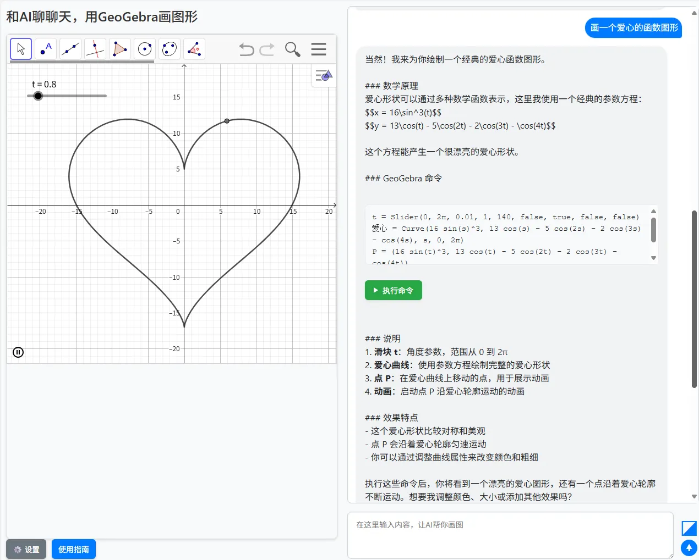

# 和AI聊天，用GeoGebra画图

发布时间: *2025-09-29 09:55:00*

分类: __综合开发__

简介: 介绍一个结合 GeoGebra 数学软件与 AI 对话功能的智能工具，用户可以通过自然语言与 AI 进行数学相关问题的交流，AI 会生成相应的 GeoGebra 命令并自动在画板上绘制图形。

---------

## 概述

先上演示应用 <https://www.snowpeak.org/math_question/ggb.htm>

演示运行的截图：


项目源码已开源 <https://github.com/xfsnow/xfsnow.github.io/blob/master/math_question/ggb.htm>

### 谁适合看此文档？

本文深入讲解了一个结合 GeoGebra 数学软件与 AI 对话功能的智能工具——ChatGGB 的开发过程和实现原理。适用于对前端开发、AI 集成和数学可视化感兴趣的朋友，了解 JavaScript、HTML/CSS 基本语法，有一定的前端开发经验。

### 此文档有什么用？

此文档介绍的内容适用于较大规模的前端开发项目，尤其是涉及 AI 集成、数学可视化和用户交互设计的场景。通过详细介绍 ChatGGB 项目的架构和实现细节，帮助开发者理解如何将 AI 技术与数学软件结合，创造出实用的教育工具。

### 意义

在教育和数学研究领域，可视化是一个非常重要的工具。传统的数学软件需要用户掌握特定的命令语法，而将 AI 与 GeoGebra 结合可以大大降低使用门槛，使用户能够通过自然语言与系统交互，自动生成和执行数学命令。这不仅提高了用户体验，也拓展了数学软件的应用场景。

ChatGGB 项目的意义在于：
1. 提供了一种全新的数学学习和研究方式
2. 展示了如何将多种 AI 模型集成到一个统一的界面中
3. 实现了 AI 与数学软件的无缝连接
4. 为教育技术的发展提供了新的思路

## 项目背景与需求场景

### 项目背景

GeoGebra 是一款优秀的数学软件，广泛应用于教育领域。然而，使用 GeoGebra 需要掌握其特定的命令语法，这对初学者来说是一个门槛。同时，随着 AI 技术的发展，特别是大语言模型在理解和生成自然语言方面的能力不断提升，将 AI 与数学软件结合成为可能。

ChatGGB 项目应运而生，旨在通过自然语言交互降低 GeoGebra 的使用门槛，让用户能够通过简单的语言描述来生成和执行数学命令。

### 解决的需求场景

1. **降低学习门槛**：用户无需掌握复杂的 GeoGebra 命令语法，只需用自然语言描述需求
2. **提高效率**：快速生成和执行数学命令，节省手动输入时间
3. **多模型支持**：集成多种 AI 模型，满足不同用户的需求
4. **图像理解**：支持上传图片，结合图像内容进行分析和绘图
5. **教育应用**：为数学教学和学习提供直观的可视化工具

## 代码架构设计

### 整体架构

ChatGGB 项目采用纯前端架构，主要由以下几个部分组成：

1. **用户界面层**：HTML/CSS 实现的用户界面
2. **控制逻辑层**：JavaScript 实现的业务逻辑
3. **AI 接口层**：与不同 AI 模型的接口实现
4. **GeoGebra 集成层**：与 GeoGebra 的交互实现

### 核心类设计

项目采用了面向对象的设计方法，主要包含以下几个核心类：

#### AiBase 基类

AiBase 是所有 AI 模型类的基类，封装了通用的逻辑，包括：
- 消息历史管理
- 系统提示语处理
- 图片文件转 Base64 编码
- AI 响应格式化
- GeoGebra 命令提取

#### 具体 AI 模型类

项目支持三种主要的 AI 模型，每种模型都有对应的实现类，继承自 AiBase 基类：

1. **AiDeepSeek** - DeepSeek AI 类
2. **AiQwen** - 通义千问 AI 类
3. **AiAzureOpenAI** - Azure OpenAI AI 类

每个子类根据各自模型的 API 规范实现了特定的调用逻辑。

#### GGBManager 类

这是项目的核心管理类，负责协调各个组件，主要功能包括：
- 初始化 GeoGebra 应用
- 绑定界面元素和事件
- 处理用户输入和 AI 响应
- 执行 GeoGebra 命令
- 管理设置和配置

## 系统提示语设计

系统提示语是引导 AI 行为的关键部分，在 ChatGGB 项目中具有特殊的重要性。它不仅需要指导 AI 如何回答数学相关问题，还需要明确如何生成 GeoGebra 命令。

### 系统提示语的核心内容

系统提示语主要包括以下几个方面：

1. **角色定义**：明确 AI 作为几何学助手的身份
2. **行为规范**：要求 AI 在回答时提供友好的解释和清晰的 GeoGebra 命令
3. **命令格式**：规定 GeoGebra 命令必须放在特定的代码块中（``geogebra``）
4. **数学公式格式**：要求数学公式使用 $$ 包裹
5. **命令规范**：每行一个命令，不添加注释，按逻辑顺序排列

### 系统提示语的共享机制

在 ChatGGB 中，系统提示语作为全局配置，对所有 AI 模型都有效。用户只需设置一次，即可应用于所有模型，这大大简化了配置过程。

## 对话交互方式

ChatGGB 支持多种对话交互方式，满足不同场景的需求：

### 纯文本对话

用户可以直接输入文本问题，如"画一个半径为3的圆"，AI 会解析问题并生成相应的 GeoGebra 命令。

### 文本加图片对话

对于更复杂的场景，用户可以上传图片并结合文本描述进行提问。这特别适用于以下场景：
- 上传几何题目图片，询问解题方法并绘制图形
- 上传函数图像，要求分析函数性质并绘制相似图形
- 上传实际场景照片，要求抽象为数学模型并绘制

这一功能主要由支持视觉理解的模型实现，如 Azure OpenAI 的 gpt-4o 和通义千问的 qwen3-vl-plus。

## 图片处理与接口调用

### 本地图片处理流程

当用户选择上传图片时，系统会执行以下步骤：

1. **文件选择**：用户通过文件选择器选择本地图片
2. **格式校验**：检查文件类型（JPG/PNG/GIF/WEBP）和大小（不超过10MB）
3. **转换编码**：使用 FileReader 将图片文件转换为 Base64 编码
4. **预览显示**：在界面中显示图片预览
5. **数据存储**：将 Base64 编码存储在共享状态中

### 图片参数组织

在调用支持视觉理解的 AI 模型时，需要将图片和文本组织成特定的参数格式：

```javascript
// 构造包含图片和文本的用户消息
const userContent = [
  { type: "text", text: "请分析这张图片中的几何图形并绘制出来" },
  { 
    type: "image_url", 
    image_url: {
      url: "data:image/jpeg;base64,/9j/4AAQSkZJRgABAQAAAQ..."
    }
  }
];
```

这种结构化的方式允许 AI 同时处理文本和图像信息，提供更丰富的交互体验。

## 调用大模型的主要原理

### 统一接口设计

项目通过继承 AiBase 基类，为不同的 AI 模型实现了统一的接口。这样做的好处是：
1. 代码结构清晰，易于维护和扩展
2. 新增 AI 模型只需继承基类并实现特定方法
3. 上层调用逻辑无需关心具体模型的实现细节

### 流式传输处理

为了提供更好的用户体验，项目采用了流式传输技术，实时显示 AI 的思考过程。这种方式让用户能够看到 AI 逐步生成的响应，而不是等待完整响应后再显示。

### 多模型支持机制

项目通过模型选择机制支持多种 AI 模型，用户可以根据需求选择合适的模型。每种模型都有独立的配置项，但共享系统提示语等全局设置。

## 项目特点与优势

### 多模型支持

ChatGGB 支持多种主流 AI 模型：

1. **DeepSeek**：适合中文场景的开源大模型
2. **通义千问**：阿里巴巴的千问系列模型，支持图像理解
3. **Azure OpenAI**：微软 Azure 平台的 OpenAI 服务

### 图像理解能力

项目支持上传图片并与 AI 进行结合分析，这是通过 Azure OpenAI 的 gpt-4o 模型和通义千问的 qwen3-vl-plus 模型实现的。这些模型具备强大的视觉理解能力，能够分析图片中的数学内容并生成相应的 GeoGebra 命令。

### 本地存储配置

用户的配置信息通过 localStorage 进行持久化存储，包括各模型的 API 密钥和系统提示语等。这样用户在下次访问时无需重新配置。

## 总结

ChatGGB 项目通过将 AI 技术与 GeoGebra 数学软件相结合，为用户提供了一种全新的数学学习和研究方式。项目采用模块化设计，具有良好的扩展性和维护性，支持多种 AI 模型和图像理解功能。

通过这个项目，我们可以看到：
1. AI 技术在教育领域的巨大潜力
2. 前端技术在实现复杂交互方面的强大能力
3. 开源技术在推动教育创新中的重要作用

未来，该项目还可以进一步扩展，例如：
1. 增加更多的 AI 模型支持
2. 提供更丰富的可视化效果
3. 增强交互性和用户体验
4. 和数学题库系统集成，实现数学题的拍照解答和识别绘制精准的数学图形
